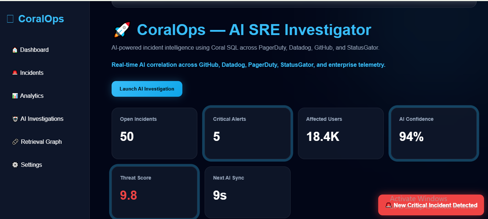
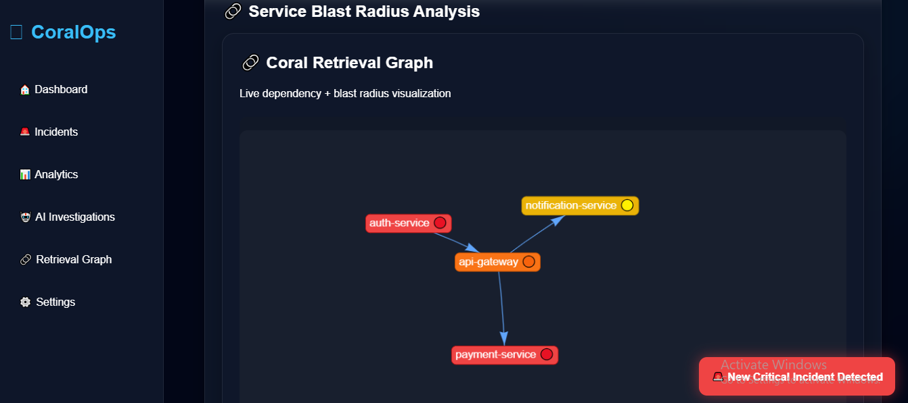
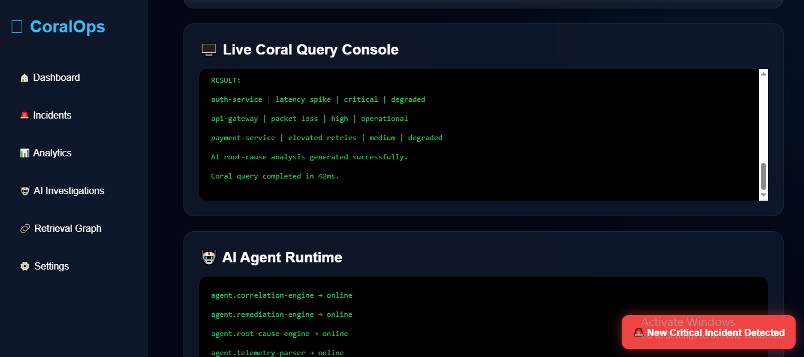

# 🪸 CoralOps — AI SRE Investigator

AI-powered incident intelligence platform built using Coral SQL, MCP integrations, AI retrieval workflows, and cross-source operational telemetry correlation.

CoralOps demonstrates how AI agents can investigate production incidents by correlating GitHub deployments, Datadog telemetry, PagerDuty escalations, and StatusGator outages using live SQL-style joins.

---

# 🚀 Features

* Cross-source Coral SQL joins
* AI-powered incident investigation
* Autonomous remediation workflows
* MCP-compatible telemetry integrations
* Live Coral query console
* AI agent runtime monitoring
* Coral schema learning simulation
* Coral query cache engine
* Enterprise SRE dashboard UI
* Operational blast-radius analysis
* AI remediation recommendations
* Retrieval graph visualization
* Autonomous operational intelligence

---

# 🧠 Problem Statement

Modern production incidents span multiple operational systems:

* GitHub deployments
* Datadog telemetry
* PagerDuty escalations
* StatusGator outages

Investigations become fragmented and slow because engineers constantly switch between tools during critical incidents.

CoralOps solves this by using Coral SQL to query and correlate operational telemetry in a single AI-native investigation workflow.

---

# 🪸 Why Coral?

Coral enables:

* Query Anything as SQL
* Cross-source joins
* Schema learning
* Smart caching
* AI retrieval workflows
* MCP-compatible integrations
* Live operational querying

CoralOps demonstrates how Coral can power autonomous AI SRE workflows without ETL pipelines or data warehouses.

---

# ⚡ Coral SQL Example

```sql
SELECT
  g.deployment,
  d.metric_alert,
  p.escalation_level,
  s.outage_status

FROM github.pull_requests g

JOIN datadog.alerts d
ON d.timestamp >= g.merged_at

JOIN pagerduty.incidents p
ON p.priority = 'critical'

JOIN statusgator.outages s
ON s.status = 'degraded';
```

---

# 🤖 AI Investigation Workflow

1. GitHub deployment detected
2. Datadog telemetry anomaly identified
3. PagerDuty escalation correlated
4. StatusGator outage matched
5. Coral SQL joins operational telemetry
6. AI agents generate root-cause analysis
7. Autonomous remediation recommendations created

---

# 🧩 MCP + Agent Infrastructure

CoralOps includes:

* MCP-compatible investigation agents
* AI remediation engines
* Operational telemetry orchestration
* Autonomous retrieval pipelines
* Cross-source operational intelligence
* AI runtime monitoring

---

# 💻 Coral CLI Workflow

```bash
coral source add github

coral source add datadog

coral source add pagerduty

coral source add statusgator

coral query incident-investigation.sql
```

---

# ⚡ Coral Query Cache Engine

* Cached Queries: 148
* Cache Hit Rate: 94%
* Query Latency: 42ms

---

# 🧠 Coral Schema Learning

CoralOps demonstrates schema learning across:

* GitHub deployment schemas
* Datadog telemetry schemas
* PagerDuty escalation schemas
* StatusGator outage schemas

---

# 🌐 Enterprise AI SRE Dashboard

The platform includes:

* Live incident monitoring
* AI incident summaries
* Blast-radius analysis
* Autonomous remediation recommendations
* Live Coral query execution
* AI operational intelligence
* Retrieval graph visualization
* Cross-source telemetry orchestration

---

# 🛠️ Tech Stack

* HTML
* CSS
* JavaScript
* Coral SQL
* MCP Concepts
* AI Retrieval Workflows

---

# 📸 Screenshots

## Dashboard Overview



---

## Retrieval Graph



---

## Coral SQL Console




---

# 🚀 Deployment

Deployed using Vercel.

---

# 🔥 Future Improvements

* Real Coral backend integration
* Live MCP server connectivity
* Real-time operational telemetry
* AI remediation execution
* Kubernetes remediation automation
* Autonomous rollback execution

---

# 🪸 CoralOps

Enterprise AI operational intelligence powered by Coral SQL.

---

# 🤖 AI Assistance Disclosure

This project used AI tools including ChatGPT for:

* brainstorming ideas
* UI/UX refinement
* architecture planning
* workflow iteration
* documentation assistance

Final implementation, customization, dashboard architecture, integrations, and project assembly were completed by Adil Khan.
